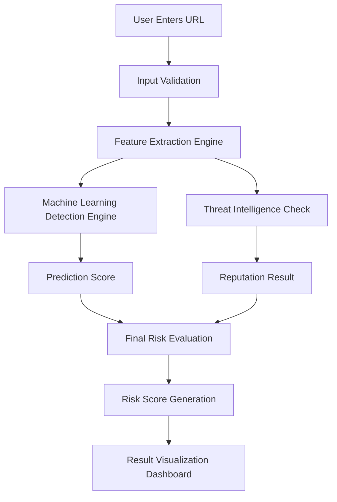
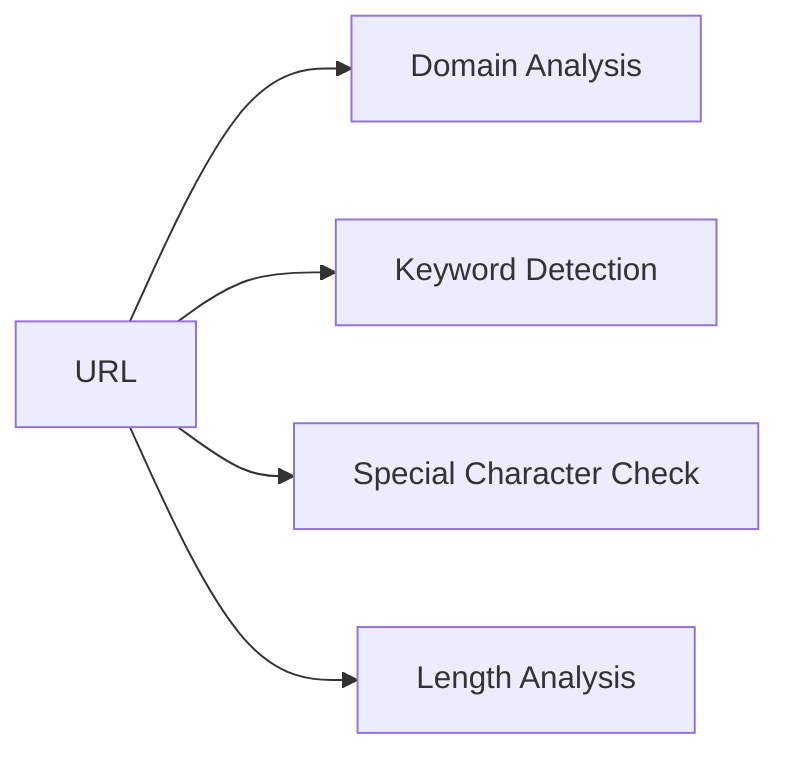
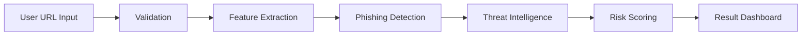

# Smart Phishing Detection & URL Risk Analyzer (Web-Based)

## System Mechanism Documentation


## Overall System Flow




# 1. User Input Stage

## What This Module Is

The User Input stage is the entry point of the system where the user provides a URL that needs to be analyzed.

## Purpose

The purpose of this module is to allow users to submit a suspicious or unknown URL so that the system can evaluate its risk level.

## Example

| User Action         | System Response                      |
| ------------------- | ------------------------------------ |
| User enters URL     | System receives the URL for analysis |
| User clicks Analyze | URL is sent to validation module     |

Example Input:

```
http://secure-login-paypal-update.xyz
```

---

# 2. Input Validation Module

## What This Module Is

This module verifies whether the URL entered by the user follows a valid and acceptable structure.

## Purpose

The purpose of this stage is to ensure that the system only analyzes properly formatted URLs and prevents invalid inputs from entering the detection process.

## Example Validation Checks

| Check Type      | Example                     |
| --------------- | --------------------------- |
| Protocol Check  | http:// or https:// present |
| Domain Check    | Domain name exists          |
| Character Check | No invalid characters       |

### Example

| Input URL                                                                      | Result  |
| ------------------------------------------------------------------------------ | ------- |
| [http://secure-login-paypal-update.xyz](http://secure-login-paypal-update.xyz) | Valid   |
| paypal-login                                                                   | Invalid |

If valid, the URL moves to the next stage.

---

# 3. URL Feature Extraction Engine

## What This Module Is

The Feature Extraction Engine analyzes the structure of the URL and extracts characteristics that may indicate phishing activity.

## Purpose

The purpose of this module is to identify structural features that are commonly present in malicious URLs.

## Example URL

```
http://secure-login-paypal-update.xyz
```

### Extracted Features

| Feature             | Example Result |
| ------------------- | -------------- |
| URL Length          | Medium         |
| Hyphens in domain   | Present        |
| Suspicious keywords | login, secure  |
| Domain structure    | unusual        |
| Top level domain    | .xyz           |

### Visual Breakdown



These extracted features are sent to the phishing detection module.

---

# 4. Phishing Detection Engine

## What This Module Is

This module evaluates whether the extracted URL features match patterns commonly used in phishing attacks.

## Purpose

The purpose of this module is to analyze suspicious indicators and determine whether the URL may be attempting to imitate legitimate websites.

## Example Indicators

| Indicator           | Example                    |
| ------------------- | -------------------------- |
| Suspicious keywords | login                      |
| Brand impersonation | paypal                     |
| Multiple hyphens    | secure-login-paypal-update |

### Example Detection

| Feature Detected | Interpretation      |
| ---------------- | ------------------- |
| login keyword    | phishing indicator  |
| paypal keyword   | brand impersonation |
| multiple hyphens | suspicious domain   |

This analysis produces detection indicators used in the next stage.

---

# 5. Threat Intelligence Check

## What This Module Is

This module checks whether the submitted URL or domain appears in known phishing or malicious website databases.

## Purpose

The purpose of this module is to improve detection accuracy by comparing the URL with known cybersecurity threat sources.

## Example Threat Databases

| Source     | Purpose                 |
| ---------- | ----------------------- |
| PhishTank  | Known phishing websites |
| VirusTotal | Malicious URL reports   |
| OpenPhish  | Phishing threat feeds   |

### Example Result

| Domain Checked                 | Database Result            |
| ------------------------------ | -------------------------- |
| secure-login-paypal-update.xyz | Not found                  |
| paypal-login-security.net      | Found in phishing database |

This information contributes to the final risk evaluation.

---

# 6. Risk Scoring System

## What This Module Is

The Risk Scoring System calculates an overall risk level for the analyzed URL based on the indicators detected in previous modules.

## Purpose

The purpose of this module is to generate a clear risk classification so that users can understand whether the URL may be dangerous.

## Example Risk Indicators

| Indicator             | Risk Contribution |
| --------------------- | ----------------- |
| Suspicious keyword    | Medium            |
| Brand impersonation   | High              |
| Multiple hyphens      | Medium            |
| Threat database match | Very High         |

### Example Score

| Indicator         | Score |
| ----------------- | ----- |
| Keyword detected  | 20    |
| Hyphen usage      | 10    |
| Suspicious domain | 20    |

Final Risk Score:

```
Total Risk = 50
```

---

# 7. Result Visualization Dashboard

## What This Module Is

The Result Visualization Dashboard presents the final analysis to the user.

## Purpose

The purpose of this module is to display the risk assessment in a clear and understandable format so that users can decide whether the URL is safe.

## Example Output

| Field        | Value                          |
| ------------ | ------------------------------ |
| Analyzed URL | secure-login-paypal-update.xyz |
| Risk Score   | 50%                            |
| Risk Level   | Suspicious                     |

### Dashboard Example

```
URL Analysis Result

Status: Suspicious

Reasons:
• Suspicious keyword detected
• Multiple hyphens in domain
• Unusual domain structure
```

---

# Complete System Pipeline



---

# Summary

The Smart Phishing Detection & URL Risk Analyzer processes URLs through a structured pipeline of modules designed to identify phishing indicators and evaluate risk levels. By combining URL structure analysis, phishing pattern detection, threat intelligence verification, and risk scoring, the system helps users recognize potentially dangerous links before visiting them.

The modular design allows each component to perform a specific task in the analysis process, resulting in a comprehensive and understandable risk assessment.

---
##### © 2026 Kunal Harshad Patil