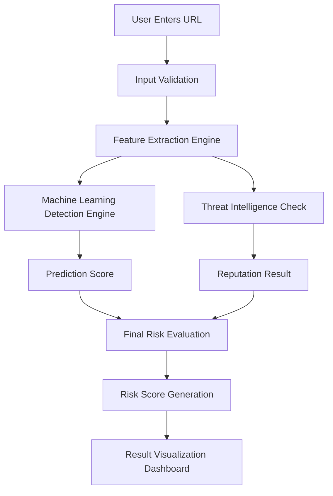

# 🔗 Smart Phishing Detection & URL Risk Analyzer

A web-based system that analyzes URLs and evaluates potential phishing risks to help users identify suspicious or malicious links before accessing them.

---

## 🚀 Project Overview

This project is designed to provide **real-time URL risk analysis** using a hybrid approach:

- 🔍 Rule-based validation  
- 🧠 Feature extraction engine  
- 🛡️ Threat intelligence (OpenPhish + URLHaus)  
- 🤖 Machine Learning (planned / in progress)  

The system ensures users can detect phishing attempts **before becoming victims**.

---
## Overall System Flow

---

## ⚙️ System Architecture

...
---

## 📁 Project File Structure

...

---

## 🧠 Backend Overview

The backend is built using **Flask** and follows a clean modular design:

### 🔹 Validator Module
- Ensures valid URL input  
- Enforces standard format (`http/https + www`)  

### 🔹 Feature Extraction Engine
- Converts URL into numerical feature vector  
- Extracts domain for threat intelligence  
- Serves dual purpose:
  - ML input  
  - Threat DB lookup  

### 🔹 Threat Intelligence Module
- Uses OpenPhish + URLHaus feeds  
- Local database for fast lookup  
- Domain-based matching  

### 🔹 ML Engine *(In Progress)*
- Predicts phishing likelihood  
- Uses trained model on extracted features  

### 🔹 Evaluator Module *(Planned)*
- Combines ML + Threat Intel results  
- Produces final decision  

### 🔹 Scoring Module *(Planned)*
- Generates risk score (0–100%)  
- Weighted logic:
  - ML → 40%  
  - Threat Intel → 60%  

---

## 🌐 Frontend Overview

The frontend is built using:

- React + Vite  
- Tailwind CSS  

### Features:
- User-friendly URL input interface  
- Real-time analysis results  
- Clean and responsive UI  

---

## 🔄 Workflow

1. User submits URL

2. Validator cleans & standardizes input

3. Feature extractor generates features + domain

4. Threat Intel checks local DB

5. (Future) ML model predicts risk

6. Evaluator combines results

7. Scorer generates confidence score

8. Final response returned to user

---

## 🛡️ Threat Intelligence System

- Sources:
  - OpenPhish  
  - URLHaus  

- Automated DB update:
  - Downloads feeds  
  - Extracts domains  
  - Removes duplicates  
  - Safely replaces database  

---

## 📌 Key Highlights

- ✔ Modular architecture
- ✔ Scalable design
- ✔ Real-time detection capability
- ✔ Hybrid detection approach (ML + Threat Intel)
- ✔ Production-style pipeline

---

## 🚧 Current Status

- ✔ Validator Module         → Completed
- ✔ Feature Extractor        → Completed
- ✔ Threat Intelligence      → Completed
- ✔ Pipeline Integration     → Completed
- ⏳ ML Engine               → In Progress
- ⏳ Evaluator & Scorer      → Planned

---

## 📖 Future Enhancements

- Advanced ML models  
- Subdomain-aware threat matching  
- API security improvements  
- Analytics dashboard  
- Browser extension  

---
