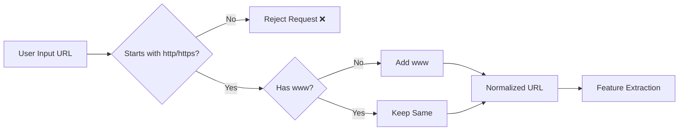
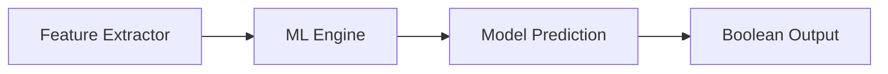
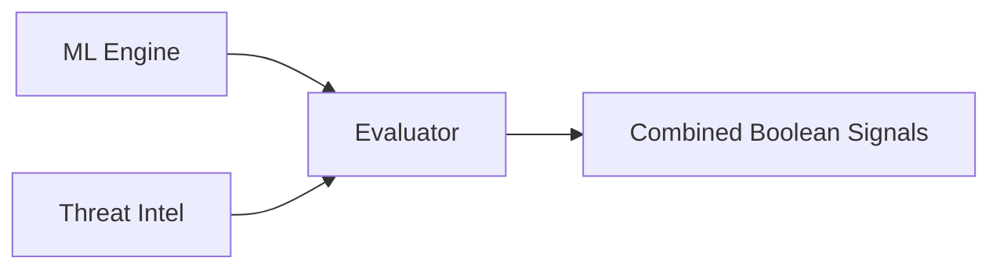

# 📁 Backend Architecture (Module-Based Design)

```id="arch_struct"
backend/
│
├── app.py                          # API entry point
│
├── modules/
│   ├── __init__.py
│   ├── pipeline.py                 #  main orchestrator
│
│   ├── validator.py                # Input Validation Module
│   ├── feature_extractor.py        # Feature Extraction Engine
│
│   ├── ml_engine.py                # Machine Learning Detection
│   ├── threat_intel.py             # Threat Intelligence Check
│
│   ├── evaluator.py                # Final Risk Evaluation
│   ├── scorer.py                   # Risk Score Generation
│
│   ├── response_builder.py         # Final JSON response formatting
│
├── models/
│   ├── phishing_url_model.pkl
│   ├── feature_columns.pkl
│
|── data/
│   ├── threat_db.txt   # cleaned domain list for threat intel
|
|── scripts/
│   ├── update_db.py    # auto-update script to update threat_db to ensure database update syc
|
├── config/
│   ├── settings.py                 # API keys, thresholds
│
├── utils/
│   ├── helpers.py
│
├── requirements.txt
├── Dockerfile
├── .dockerignore
│
└── README.md
```

---

# 🧠 Module Mapping to Flow Digram 

| Diagram Module        | Backend File         |
| --------------------- | -------------------- |
| Input Validation      | validator.py         |
| Feature Extraction    | feature_extractor.py |
| ML Detection          | ml_engine.py         |
| Threat Intelligence   | threat_intel.py      |
| Prediction Score      | ml_engine.py         |
| Reputation Result     | threat_intel.py      |
| Final Risk Evaluation | evaluator.py         |
| Risk Score Generation | scorer.py            |
| Result Dashboard      | response_builder.py  |

---

# 🔥 Module Responsibilities

## 🔹 validator.py (✅ Completed)

### 📌 Purpose
Handles input validation and normalization before passing data to the pipeline.

### ✅ Responsibilities
- Accept JSON input from frontend/API
- Validate URL format
- Ensure only `http://` or `https://` URLs are allowed
- Normalize URL by ensuring `www` is present
- Return clean URL for further processing

---

### 🔄 Flow



---

### 🧠 Key Design Decision

* We **do NOT auto-add protocol (http/https)** → must be provided
* We **only normalize `www`**
* Keeps behavior predictable and secure

---

## 🔹 feature_extractor.py (⚙️ Need to Work hire)

### 📌 Purpose
- Convert validated URL → structured feature vector for ML model

### ⚠️ Important Design Note

Feature extractor serves **dual purpose**:

1. Generate feature vector → for ML model  
2. Extract domain → for Threat Intelligence module  

---

### 📊 Selected Features (Exact Order)

```

URLLength
DomainLength
IsDomainIP
CharContinuationRate
URLCharProb
TLDLength
NoOfSubDomain
HasObfuscation
NoOfObfuscatedChar
ObfuscationRatio
NoOfLettersInURL
LetterRatioInURL
NoOfDegitsInURL
DegitRatioInURL
NoOfEqualsInURL
NoOfQMarkInURL
NoOfAmpersandInURL
NoOfOtherSpecialCharsInURL
SpacialCharRatioInURL
IsHTTPS
Bank
Pay
Crypto

```

---

### 🧪 Verification Strategy

To ensure correctness, we verify our feature extraction against the dataset:

- Extract features using our code
- Compare with dataset’s precomputed values
- Match logic exactly

---

### 📁 Test Script

- Location: `tests/test_compare.py`
- Purpose:
  - Take dataset rows
  - Recalculate features
  - Compare **Expected vs Generated**

---

### ⚠️ Current Status

- Feature extraction is **working but not fully aligned**
- Some mismatches still exist due to:
  - Dataset-specific calculation logic
  - Hidden/complex feature definitions

---

### 🧠 Important Note

```

Model is trained on dataset → Feature logic MUST match dataset exactly

```

If not:

```

Correct Model + Wrong Features = Wrong Predictions ❌

```

---

### 🎯 Goal

- Achieve **100% feature match with dataset**
- Ensure reliable ML predictions
---

## 🔹 ml_engine.py

## 🔹 ml_engine.py (⚙️ Machine Learning Detection Engine)

### 📌 Purpose
- Perform phishing detection using a **trained Machine Learning model**
- Take feature vector directly from `feature_extractor.py`
- Return a **boolean prediction** for pipeline use

---

### 🧠 Design Philosophy

- ML module focuses **only on prediction**
- No data transformation (features already aligned)
- Output is standardized as **boolean signal**


---

### 🔍 Input Explanation

* `features`:

  * Direct output from `feature_extractor.py`
  * Already aligned with training dataset
  * No additional preprocessing required

---

### ⚙️ Internal Workflow

```text id="ml-flow-final"
✔ Load trained ML model (.pkl)
✔ Take feature values from JSON
✔ Pass directly to model
✔ Run prediction
✔ Convert output → boolean
```

---

### 📤 Output

```json id="ml-output-final"
{
  "ml_prediction": true
}
```

---

### 🔍 Output Explanation

* `ml_prediction`:

  * Boolean result from model
  * `true` → phishing predicted
  * `false` → safe predicted

---

### 🔄 Conversion Rule

```text id="ml-convert-final"
Model Output → Final Output

1 → True  
0 → False
```

---

### 🚀 Flow Diagram



---

### 💯 Key Design Benefits

* ✔ No unnecessary preprocessing
* ✔ Faster execution
* ✔ Clean and minimal design
* ✔ Direct integration with evaluator
* ✔ Reduced chances of feature mismatch

---

### ⚠️ Important Notes

```text id="ml-notes-final"
✔ Feature order MUST match training dataset  
✔ Model file (.pkl) must be present in /models  
✔ No business logic inside ML module  
✔ Only prediction + conversion
```

---

### 🔮 Future Enhancements

```json id="ml-future-final"
{
  "ml_prediction": true,
  "probability": 0.87
}
```

* Add confidence score
* Support multiple models
* Ensemble methods

---

### 🔗 Integration

```text id="ml-integration-final"
feature_extractor → ml_engine → evaluator → scorer
```


---

## 🔹 threat_intel.py (⚙️ In Progress)

### 📌 Purpose
- Check if a given URL/domain is already known as **malicious**
- Uses **open-source threat intelligence feeds**
- Works **offline using locally stored database**

---

### 🧠 Data Sources (Free & Open)

- OpenPhish → phishing URLs  
- URLhaus → malware URLs  

---

### ⚙️ Design Approach

Instead of calling APIs in real-time:

```

Download feeds → store locally → fast lookup

```

---

### 📁 Database Structure

```

backend/
│
├── data/
│   ├── threat_db.txt   ← cleaned domain list
│
├── scripts/
│   ├── update_db.py    ← auto-update script

```

---

### 🔄 Update Mechanism

- Data is downloaded from open sources
- URLs are processed to extract **only domain**
- Duplicate entries are removed
- Stored as a clean domain list

---

### ⏱️ Automation

Database can be updated:

- Manually → run script  
- Automatically → cron job (recommended)

Example:
```

0 3 * * * python scripts/update_db.py

```

---

### 🔍 Detection Logic

```

Input → Domain
Check → Local Database (set lookup)
Output → Malicious / Safe

````

---

### 📤 Output Example

```json
{
  "is_malicious": true,
  "source": "local_db",
  "type": "phishing"
}
````

---

### ⚡ Performance

* Uses Python `set()` for lookup
* O(1) time complexity
* Very fast and scalable

---

### 🎯 Goal

* Provide **real-world threat intelligence layer**
* Enhance ML model predictions
* Detect already known malicious domains instantly

---

### 1)🔹 update_db.py (⚙️ Threat Database Builder)

### 📌 Purpose
- Automatically build and maintain a **local threat intelligence database**
- Collect data from **open-source phishing/malware feeds**
- Prepare a **clean, fast, and ready-to-use domain list** for the system

---

### 🎯 Key Responsibilities

- Download threat feeds (OpenPhish, URLhaus)
- Extract **only domain names** from URLs
- Normalize data (convert to lowercase)
- Remove duplicates
- Generate a clean database file

---

### 📁 Output

```

backend/data/threat_db.txt

```

Example:
```

phishing-site.com
fake-login.net
malware-download.xyz

````

---

### 🔄 Working Flow

```mermaid
flowchart LR
A[Download Feeds] --> B[Extract Domains]
B --> C[Normalize (lowercase)]
C --> D[Remove Duplicates]
D --> E[Write temp file]
E --> F[Replace final DB safely]
````

---

### ⚙️ File Handling Strategy

* Uses **temporary file + replace**
* Prevents corruption during updates

```
threat_db_temp.txt → threat_db.txt
```

✔ No manual deletion
✔ No partial writes
✔ Always safe

---

### 🌍 Cross-Platform Support

* Works on **Linux, Windows, macOS**
* Uses only **Python standard libraries**
* No OS-specific commands (no `wget`, `mv`, etc.)

---

### 📦 Auto Setup

* Automatically creates `data/` folder if missing
* Automatically creates/overwrites database file
* No manual setup required

---

### ⏱️ How to Run

```bash
python scripts/update_db.py
```

---


### ⚠️ Important Notes

* Only **domain names** are stored (not full URLs)
* Domains are **case-insensitive → stored in lowercase**
* Database is **rebuilt completely on each run**
* Designed for **fast lookup using Python set()**

---

### 🔗 Integration

```
update_db.py → builds DB
threat_intel.py → uses DB
```

---

### 🎯 Goal

* Provide **real-time-like threat detection without APIs**
* Ensure **fast, reliable, offline domain checking**
* Enhance overall system security alongside ML model


---
## 🔹 evaluator.py (⚙️ Decision Data Combiner)

### 📌 Purpose
- Combine outputs from:
  - Machine Learning module (ML)
  - Threat Intelligence module
- Prepare a **clean, unified signal format** for the scoring engine

---

### 🧠 Design Philosophy

- Evaluator is **NOT responsible for decision making**
- It only **standardizes and combines signals**
- Keeps architecture **modular and scalable**

```

ML + Threat Intel → Evaluator → Scorer

````

---

### 📥 Input

```json
{
  "ml_prediction": true,
  "threat_intel": {
    "is_malicious": false
  }
}
````

---

### 🔍 Input Explanation

* `ml_prediction`:

  * Boolean value from ML model
  * `true` → phishing predicted
  * `false` → safe predicted

* `threat_intel.is_malicious`:

  * Boolean value from threat database
  * `true` → domain found in blacklist
  * `false` → not found

---

### 📤 Output (to scorer.py)

```json
{
  "ml_prediction": true,
  "threat_found": false
}
```

---

### 🔍 Output Explanation

* `ml_prediction`:

  * Direct ML signal (boolean)

* `threat_found`:

  * Renamed from `is_malicious`
  * Indicates presence in threat database

---

### ⚙️ Internal Logic

```text
✔ Extract ml_prediction (boolean)
✔ Extract threat_intel.is_malicious
✔ Convert to:
    threat_found = is_malicious
✔ Return combined JSON
```

---

### 🚀 Flow Diagram



---

### 💯 Key Design Benefits

* ✔ Clean separation of concerns
* ✔ No duplicate logic
* ✔ Easy to extend (add more signals later)
* ✔ Optimized for scoring calculations
* ✔ Reduces complexity in pipeline

---

### 🔮 Future Extensions

Evaluator can later include:

```json
{
  "ml_prediction": true,
  "threat_found": true,
  "heuristic_flag": false,
  "reputation_score": 0.7
}
```

---

### ⚠️ Important Notes

* ML module must convert output to **boolean (0 → False, 1 → True)**
* Evaluator assumes **valid structured input**
* No scoring or decision logic should be added here


---

## 🔹 scorer.py

* Generate:

  * Risk score (0–100)
  * Risk level:

    * Low
    * Medium
    * High

---

## 🔹 response_builder.py

* Format final JSON response
* Send to frontend

---

## 🔹 pipeline.py (CORE 🔥)

```text
Controls full system flow:
validate → extract → ML → threat → evaluate → score → response
```

---

# 🧠 IMPORTANT DESIGN DECISION

```text id="key_insight"
Pipeline is NOT linear only  
ML + Threat Intel run in parallel conceptually
```

But in code:

```text id="impl"
We call both → then combine results
```

---

# 🔄 FINAL SYSTEM FLOW 

```id="flow_final"
User Input
   ↓
Validation
   ↓
Feature Extraction
   ↓
ML Engine ───────┐
                 ├──→ Evaluator → Scorer → Response
Threat Intel ────┘
```

---

# 🐳 Docker Compatibility

* Entire backend runs inside container
* All modules bundled
* Easy deployment

---

