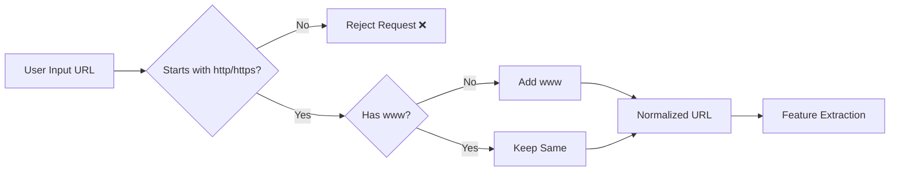

# 📁 Backend Architecture (Module-Based Design)

```id="arch_struct"
backend/
│
├── app.py                          # API entry point
│
├── modules/
│   ├── __init__.py
│   ├── pipeline.py                 #  main orchestrator
│
│   ├── validator.py                # Input Validation Module
│   ├── feature_extractor.py        # Feature Extraction Engine
│
│   ├── ml_engine.py                # Machine Learning Detection
│   ├── threat_intel.py             # Threat Intelligence Check
│
│   ├── evaluator.py                # Final Risk Evaluation
│   ├── scorer.py                   # Risk Score Generation
│
│   ├── response_builder.py         # Final JSON response formatting
│
├── models/
│   ├── phishing_url_model.pkl
│   ├── feature_columns.pkl
│
├── config/
│   ├── settings.py                 # API keys, thresholds
│
├── utils/
│   ├── helpers.py
│
├── requirements.txt
├── Dockerfile
├── .dockerignore
│
└── README.md
```

---

# 🧠 Module Mapping to Flow Digram 

| Diagram Module        | Backend File         |
| --------------------- | -------------------- |
| Input Validation      | validator.py         |
| Feature Extraction    | feature_extractor.py |
| ML Detection          | ml_engine.py         |
| Threat Intelligence   | threat_intel.py      |
| Prediction Score      | ml_engine.py         |
| Reputation Result     | threat_intel.py      |
| Final Risk Evaluation | evaluator.py         |
| Risk Score Generation | scorer.py            |
| Result Dashboard      | response_builder.py  |

---

# 🔥 Module Responsibilities

## 🔹 validator.py (✅ Completed)

### 📌 Purpose
Handles input validation and normalization before passing data to the pipeline.

### ✅ Responsibilities
- Accept JSON input from frontend/API
- Validate URL format
- Ensure only `http://` or `https://` URLs are allowed
- Normalize URL by ensuring `www` is present
- Return clean URL for further processing

---

### 🔄 Flow



---

### 🧠 Key Design Decision

* We **do NOT auto-add protocol (http/https)** → must be provided
* We **only normalize `www`**
* Keeps behavior predictable and secure

---

## 🔹 feature_extractor.py (⚙️ Need to Work hire)

### 📌 Purpose
- Convert validated URL → structured feature vector for ML model

### ⚠️ Important Design Note

Feature extractor serves **dual purpose**:

1. Generate feature vector → for ML model  
2. Extract domain → for Threat Intelligence module  

---

### 📊 Selected Features (Exact Order)

```

URLLength
DomainLength
IsDomainIP
CharContinuationRate
URLCharProb
TLDLength
NoOfSubDomain
HasObfuscation
NoOfObfuscatedChar
ObfuscationRatio
NoOfLettersInURL
LetterRatioInURL
NoOfDegitsInURL
DegitRatioInURL
NoOfEqualsInURL
NoOfQMarkInURL
NoOfAmpersandInURL
NoOfOtherSpecialCharsInURL
SpacialCharRatioInURL
IsHTTPS
Bank
Pay
Crypto

```

---

### 🧪 Verification Strategy

To ensure correctness, we verify our feature extraction against the dataset:

- Extract features using our code
- Compare with dataset’s precomputed values
- Match logic exactly

---

### 📁 Test Script

- Location: `tests/test_compare.py`
- Purpose:
  - Take dataset rows
  - Recalculate features
  - Compare **Expected vs Generated**

---

### ⚠️ Current Status

- Feature extraction is **working but not fully aligned**
- Some mismatches still exist due to:
  - Dataset-specific calculation logic
  - Hidden/complex feature definitions

---

### 🧠 Important Note

```

Model is trained on dataset → Feature logic MUST match dataset exactly

```

If not:

```

Correct Model + Wrong Features = Wrong Predictions ❌

```

---

### 🎯 Goal

- Achieve **100% feature match with dataset**
- Ensure reliable ML predictions
---

## 🔹 ml_engine.py

* Load model
* Predict:

  * label (0/1)
  * probability

---

## 🔹 threat_intel.py (⚙️ In Progress)

### 📌 Purpose
- Check if a given URL/domain is already known as **malicious**
- Uses **open-source threat intelligence feeds**
- Works **offline using locally stored database**

---

### 🧠 Data Sources (Free & Open)

- OpenPhish → phishing URLs  
- URLhaus → malware URLs  

---

### ⚙️ Design Approach

Instead of calling APIs in real-time:

```

Download feeds → store locally → fast lookup

```

---

### 📁 Database Structure

```

backend/
│
├── data/
│   ├── threat_db.txt   ← cleaned domain list
│
├── scripts/
│   ├── update_db.py    ← auto-update script

```

---

### 🔄 Update Mechanism

- Data is downloaded from open sources
- URLs are processed to extract **only domain**
- Duplicate entries are removed
- Stored as a clean domain list

---

### ⏱️ Automation

Database can be updated:

- Manually → run script  
- Automatically → cron job (recommended)

Example:
```

0 3 * * * python scripts/update_db.py

```

---

### 🔍 Detection Logic

```

Input → Domain
Check → Local Database (set lookup)
Output → Malicious / Safe

````

---

### 📤 Output Example

```json
{
  "is_malicious": true,
  "source": "local_db",
  "type": "phishing"
}
````

---

### ⚡ Performance

* Uses Python `set()` for lookup
* O(1) time complexity
* Very fast and scalable

---

### 🎯 Goal

* Provide **real-world threat intelligence layer**
* Enhance ML model predictions
* Detect already known malicious domains instantly


---

## 🔹 evaluator.py

* Combine:

  * ML result
  * Threat intelligence result
* Decide final risk

---

## 🔹 scorer.py

* Generate:

  * Risk score (0–100)
  * Risk level:

    * Low
    * Medium
    * High

---

## 🔹 response_builder.py

* Format final JSON response
* Send to frontend

---

## 🔹 pipeline.py (CORE 🔥)

```text
Controls full system flow:
validate → extract → ML → threat → evaluate → score → response
```

---

# 🧠 IMPORTANT DESIGN DECISION

```text id="key_insight"
Pipeline is NOT linear only  
ML + Threat Intel run in parallel conceptually
```

But in code:

```text id="impl"
We call both → then combine results
```

---

# 🔄 FINAL SYSTEM FLOW 

```id="flow_final"
User Input
   ↓
Validation
   ↓
Feature Extraction
   ↓
ML Engine ───────┐
                 ├──→ Evaluator → Scorer → Response
Threat Intel ────┘
```

---

# 🐳 Docker Compatibility

* Entire backend runs inside container
* All modules bundled
* Easy deployment

---

